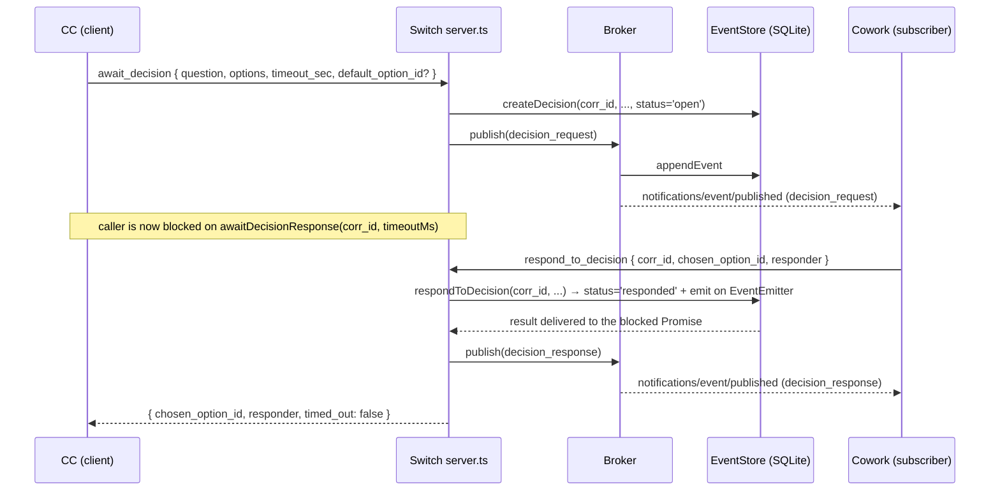
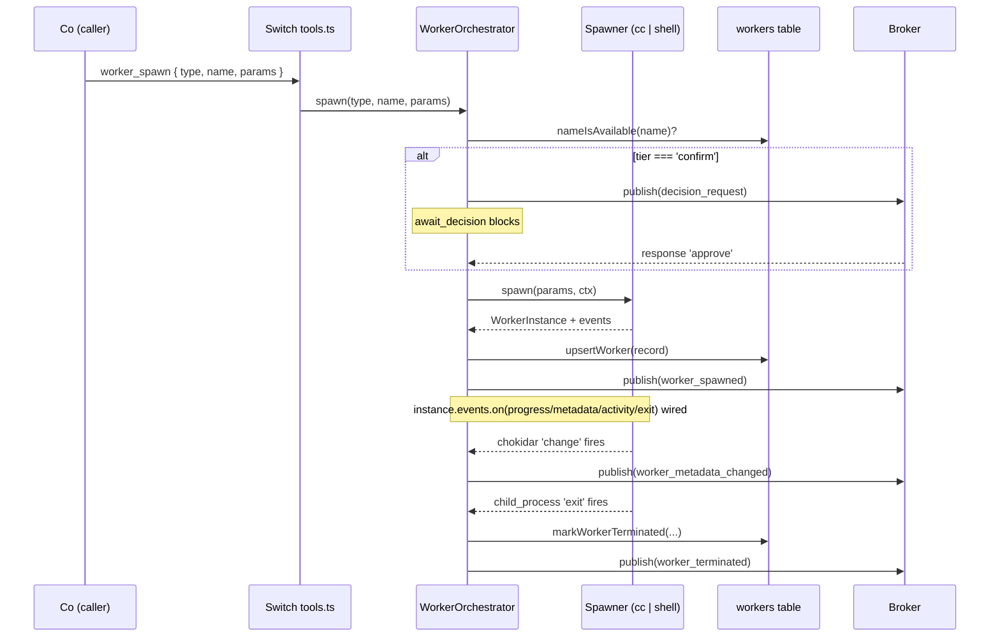

# Architecture

This document explains how Stavr is put together. It targets a contributor who has read the [README](./README.md) and now wants to extend, debug, or reason about the system. Read it once end-to-end (~20 minutes) and you should be able to find your way around any file in `src/`.

For each component we name the file path so you can jump to the canonical implementation.

---

## What is Stavr?

**Stavr** is an MCP-native broker — a single process that sits between cooperating agents (Co, CC, future agents) and the human user, and that turns every interesting moment of their work into a typed, persisted event.

The broker process is called **Switch**. Switch is an [MCP server](https://modelcontextprotocol.io/) that speaks two transports at once: stdio (for clients embedded as child processes) and HTTP/SSE (for long-lived remote clients like Cowork dashboards and other agents). It owns:

- an append-only event log (SQLite)
- a decision queue (the `await_decision` ↔ `respond_to_decision` rendezvous)
- a set of tool *adapters* (read GitHub via `gh`, more to come)

This repository is the reference implementation of Switch. Agents are *clients*; Switch is the server they all share.

---

## The big picture

```
┌──────────┐                ┌────────────────────┐                ┌──────────┐
│  Cowork  │◀──── MCP ─────▶│                    │◀──── MCP ─────▶│   CC-1   │
│  (Co)    │   (SSE/HTTP)   │                    │   (SSE/HTTP)   │ branch:  │
└──────────┘                │   Switch daemon    │                │ feat/B007│
                            │                    │                └──────────┘
┌──────────┐                │   - broker         │                ┌──────────┐
│   CC-N   │◀──── MCP ─────▶│   - event store    │◀──── MCP ─────▶│   CC-2   │
│ branch:  │   (SSE/HTTP)   │   - decision queue │   (SSE/HTTP)   │ branch:  │
│ fix/B008 │                │   - adapter regis. │                │ feat/B010│
└──────────┘                │                    │                └──────────┘
                            │   :7777 MCP        │
                            │   :7777/dashboard  │  (v0.2)
                            │   :7777/api/...    │  (v0.2)
                            └────────────────────┘
                                     ▲
                                     │ HTTP (browser)
                                     │
                            ┌────────────────────┐
                            │   User's browser   │  (v0.2)
                            │   (audit / approve)│
                            └────────────────────┘
```

One daemon per host. Binds `127.0.0.1:7777` (local-only). All remote MCP clients connect via SSE; one process can also accept a stdio client for legacy / per-spawn use. The dashboard at `:7777/dashboard` is planned for v0.2 (spec 40 Phase 2).

The picture above is the **daemon topology** — see `stavr daemon start` in the README. There is also a legacy *per-spawn* mode (`stavr start --stdio-only`) where each MCP client gets its own Switch process and SQLite store; this is what an MCP client like CC uses today when configured to launch Switch as a child process. The per-spawn model is documented in [ADR-005](./adr/005-per-spawn-architecture-v01.md); the daemon model is documented in [ADR-006](./adr/006-daemon-binds-127001-only.md).

---

## Component map

### Broker — `src/broker.ts`

The broker is the in-memory router. It owns the set of *subscriptions* (which MCP session wants which event kinds) and, on every published event, fans the event out to every matching subscriber as an MCP notification on the method `notifications/event/published`.

Public surface: `class Broker` with `registerSession`, `removeSession`, `subscribe`, `unsubscribe`, `publish`, `fanout`, `replayTo`. It also holds a reference to the `EventStore` (`broker.store`) so other code can read history without going through the broker.

The broker is intentionally thin. All durability lives in the event store; all transport state lives in `transports.ts`. The broker just decides "who hears about this event next?"

### Event store — `src/persistence.ts`

A single SQLite database at `~/.stavr/runestone.db` (configurable via `--db`). Four tables:

- `events` — every event ever published. Append-only. Indexed by `kind`, `correlation_id`, and a monotonic `seq` cursor.
- `decisions` — pending and resolved decisions, keyed by `correlation_id`. Status is one of `open | responded | expired`.
- `sessions` — per-session metadata (handoff path, branch, PRs, event counts) — currently used by future tooling, not the runtime.
- `meta` — key/value bag for future runtime config.

`EventStore` is also where `await_decision` blocks: it owns a `node:events` `EventEmitter` keyed by `correlation_id`, and `awaitDecisionResponse(id, timeoutMs)` returns a `Promise` that resolves when `respondToDecision(...)` is called, or rejects with `DecisionTimeoutError` after the timeout.

Append-only semantics are a hard rule: there is no `UPDATE` on the `events` table, ever. Corrections happen by appending a follow-up event.

### Transports — `src/transports.ts`

`mountTransports(broker, opts)` brings up one or two MCP transports against the same broker:

- **stdio** — handed to a `StdioServerTransport`. One MCP session per stdio pair; created in modes `'stdio'` and `'both'`.
- **HTTP/SSE** — `express` app with `GET /mcp/sse` to open a stream, `POST /mcp/messages?sessionId=...` to send messages back, and `GET /healthz` + `GET /status` for liveness. Each SSE connection becomes its own MCP session, sharing the broker. Created in modes `'daemon'` and `'both'` (when `opts.port` is set).

Mode resolution:

- `'stdio'` — stdio only.
- `'daemon'` — HTTP/SSE only; bind failure is fatal.
- `'both'` — stdio plus optional HTTP/SSE; on `EADDRINUSE`, falls back to stdio-only with a warning. This is the legacy `stavr start` behavior and is what makes simultaneous per-spawn MCP sessions tolerable. See [ADR-007](./adr/007-eaddrinuse-graceful-fallback.md).

On startup, transports also run `startupDecisionSweep(broker)` to expire any decisions whose deadlines elapsed while Switch was down (see [Decision flow](#decision-flow-walkthrough)).

### Adapters — `src/adapters/`

Adapters expose external systems as MCP tools. The current adapter is **GitHub**, split across two files:

- **Read-only** (`src/adapters/github.ts`): 14 tools (`github.read_pr`, `github.list_prs`, `github.read_issue`, ...) backed by the locally-installed `gh` CLI.
- **Write actions** (`src/adapters/github-writes.ts`): 10 tools (`github.create_pr`, `github.merge_pr`, `github.create_issue`, `github.create_issue_comment`, `github.create_pr_comment`, `github.close_issue`, `github.reopen_issue`, `github.add_labels`, `github.remove_labels`, `github.request_pr_review`). Each is gated by `await_decision` — see paragraph below.

Auth is inherited from the host's `gh auth login` — Switch never sees a token. See [ADR-003](./adr/003-gh-cli-not-octokit.md) and the [adapter-authoring guide](./docs/writing-an-adapter.md).

Write actions are gated at the spawner level by `await_decision`. Co (or any other MCP client) invokes them, the broker emits a `decision_request`, a human approves via Cowork or the dashboard, then the underlying `gh` invocation happens. Rejection (or 30-min timeout via the fail-safe `default_option_id='reject'`) results in a no-op with `{ ok: false, reason: 'rejected_by_user' }`. The pattern is encapsulated in `src/tools/gated-action.ts` so future write adapters (Azure, Linear, etc.) reuse the same rendezvous machinery. See [ADR-008](./adr/008-write-actions-await-decision.md) and [ADR-018](./adr/018-destructive-operations-stay-manual.md) for what stays manual forever.

Adapters register with the MCP server via `registerXxxTools(server, opts?)` and are wired into the boot sequence in `src/server.ts`. Each adapter is responsible for input validation (Zod), external-command wrapping (`execFile`/`fetch`), and a stable error shape.

### Decisions — `src/tools/decisions.ts`

The two MCP tools that implement the interactive rendezvous: `await_decision` and `respond_to_decision`. They sit on top of `EventStore.createDecision` / `awaitDecisionResponse` / `respondToDecision` and also publish `decision_request` / `decision_response` / `decision_late_response` events to the broker so dashboards and audit logs see every transition.

### Server — `src/server.ts`

`createSwitchServer(broker)` builds an `McpServer`, attaches the core event tools (`emit_event`, `subscribe_to_events`, `unsubscribe`, `get_events`), wires in `registerDecisionTools` and `registerGithubTools`, and returns a `{ server, sessionId }` handle. One handle per MCP session; multiple handles share one broker.

### CLI and daemon — `src/cli.ts`, `src/daemon.ts`, `src/connect-test.ts`

Thin wrappers over the components above:

- `stavr start` — legacy per-spawn launcher (`mode: 'both'`).
- `stavr daemon start/stop/status/restart` — manages the long-running daemon via a PID file at `~/.stavr/daemon.pid`.
- `stavr connect-test` — open an SSE session to a running daemon, emit one event, subscribe, print what came back. The minimal end-to-end smoke check.
- `stavr status` / `stavr events` — read-only views over the SQLite store.

---

## Event taxonomy summary

Every event has the same envelope: `kind`, `at` (ISO timestamp), `correlation_id?`, `tenant_id?`, `source_agent`, `payload`. Payloads are typed per-kind by Zod schemas in `src/event-types.ts` — that file is the canonical source. A future build step will export the JSON Schema form (`dist/schemas/events.json`, planned in spec 41 Wave B).

| Kind | Purpose |
|---|---|
| `session_started` / `session_ended` | Bookends for an agent session (handoff path, model, exit reason, PRs). |
| `phase_started` / `phase_completed` | Coarse milestones inside a session. |
| `file_written` | A file was edited (path, lines added/removed). |
| `command_run` | A shell command finished (exit code, duration). |
| `verification` | A check (tests, lint, type) passed or failed. |
| `commit_pushed` | A git commit landed on a branch. |
| `pr_opened` | A pull request was opened. |
| `progress` | Free-form narrative line for dashboards. |
| `decision_request` | A blocking decision was opened (see below). |
| `decision_response` | The decision was resolved. |
| `decision_late_response` | A response arrived after the decision already closed via fallback. |
| `error` | An agent hit an error (recoverable or not). |
| `checkpoint` | Snapshot of branch + last commit + dirty files + next step. |

Three patterns of use:

- **Pattern A — `await_decision`**: blocking. The caller waits for a response. See below.
- **Pattern B — `subscribe_to_events`**: long-lived. The subscriber receives notifications as events are published.
- **Pattern C — `emit_event`**: fire-and-forget. The publisher does not wait for anyone.

---

## Decision flow walkthrough

`await_decision` is the most subtle piece of Switch. Here is the full path of one decision, end-to-end:



The blocking primitive is in `EventStore.awaitDecisionResponse`: it installs a one-shot listener on a `node:events` `EventEmitter` keyed by `correlation_id`, and `respondToDecision` `emit`s on that same key. The `setTimeout` for the deadline is cleared on response.

**Timeout fallback**: if `default_option_id` was supplied and the timeout fires before a response arrives, Switch writes the default through `respondToDecision('switch-default')` and emits a `decision_response` event with `responder='switch-default'`. The caller returns `{ chosen_option_id: <default>, timed_out: true }`. If no default was supplied, the caller errors.

**Late responses**: if a human (or other agent) responds *after* the fallback already closed the decision, `respondToDecision` returns `{ ok: false, error: 'already_responded' }` and Switch emits a `decision_late_response` event so the dashboard can show "the answer arrived 4 seconds too late, here's what they would have chosen." The fallback choice stands.

**Crash recovery**: on every startup, `startupDecisionSweep` looks for `open` decisions whose `expires_at` already passed and marks them `expired`, emitting `decision_late_response` events with `responder='switch-startup-sweep'`. This keeps the dashboard honest after a daemon restart.

Cap: `timeout_sec` is hard-capped at 1800 (30 minutes) by the Zod schema in `event-types.ts`.

---

## Trust scopes — `src/trust/`

A **trust scope** is a plan-level approval (spec 46). It lets Kenneth approve
once and have all matching CONFIRM-tier actions auto-execute until the scope
expires by time or hits its action cap. The model is OAuth-scope-shaped:
typed allow-list, optional deny-list, expiration, audit trail per action.

### Gate hierarchy

Every gated action passes through this ordering, top to bottom:

1. **NEVER tier** (ADR-018) — destructive flags (`--force`, `--admin`, branch
   delete). Always manual. Trust scopes cannot override.
2. **`forbidden_actions` matchers** of any active scope — explicit deny.
   Falls through to per-action gating regardless of allow.
3. **`allowed_actions` matchers** of an active scope — auto-approve, record
   the action in `scope_actions`, emit `trust_scope_action_authorized`.
4. **CONFIRM tier** with no covering scope — opens `await_decision` as before.
5. **AUTO tier** — never gated. Unchanged.

```
                           gated action call
                                  │
                                  ▼
                       ┌──────────────────────┐
                       │  NEVER-tier list?    │──► reject (ADR-018)
                       └──────────┬───────────┘
                                  │ no
                                  ▼
                       ┌──────────────────────┐
                       │  forbidden matcher   │──► fall through
                       │  in active scope?    │   to await_decision
                       └──────────┬───────────┘
                                  │ no
                                  ▼
                       ┌──────────────────────┐
                       │  allowed matcher in  │──► run action,
                       │  active scope?       │   record under scope,
                       │  (expiry ok, cap ok) │   emit *_authorized
                       └──────────┬───────────┘
                                  │ no
                                  ▼
                       ┌──────────────────────┐
                       │  CONFIRM tier?       │──► await_decision
                       └──────────┬───────────┘
                                  │ no
                                  ▼
                              run action
```

### Storage

Two tables in `persistence.ts`:

- `trust_scopes` — scope row with status (`proposed` / `active` / `expired` /
  `revoked` / `completed`), allowed/forbidden matcher JSON, reporting JSON,
  expiry deadline, action cap, action count.
- `scope_actions` — append-only log of (scope_id, tool_name, args, result,
  executed_at). The audit trail.

The `TrustStore` class (`src/trust/store.ts`) wraps the same SQLite handle as
`EventStore` to keep transactions atomic. `findActiveScopeFor({ tool, args })`
is the hot path called from inside `gatedAction`; it lazily transitions
time-expired and cap-exhausted scopes as a side effect.

### Reporter

`src/trust/reporter.ts` taps `broker.publish` once per broker and dispatches:

- On `trust_scope_granted` — register the scope; arm a 15-min one-shot timer
  if `cadence === 'every-15-min'`.
- On `trust_scope_action_authorized` — increment action count for that scope;
  emit `trust_scope_progress` at the configured cadence; emit
  `trust_scope_completed` if the cap was just hit.
- On `trust_scope_revoked` — emit terminal `trust_scope_completed` with
  `reason: 'revoked'`.

The 15-min timer is the one ADR-012 exception — bounded one-shot, not a poll.

### MCP tools

| Tool | Tier | Purpose |
|---|---|---|
| `trust_scope_propose` | AUTO | Insert proposal; emit `trust_scope_proposed`. |
| `trust_scope_grant` | CONFIRM | Opens `await_decision` ("Grant scope ...?"); on approve, flips status to active and emits `trust_scope_granted`. |
| `trust_scope_revoke` | AUTO | Flip to revoked; emit `trust_scope_revoked`. Escape hatch. |
| `trust_scope_list` | AUTO | List with status + time/action remaining. |
| `trust_scope_status` | AUTO | One scope + its action history. |
| `trust_scope_extend` | CONFIRM | Bump deadline or cap; gates on `await_decision`. |

### What changed in `gated-action.ts`

`GatedActionOpts<T>` gained an optional `scopeCheck: { tool, args, trustStore }`
field. When present and a covering active scope is found, the action runs
immediately and emits `trust_scope_action_authorized`. When absent (or no
covering scope), the original `await_decision` path runs unchanged. Call sites
in `src/adapters/github-writes.ts` and `src/workers/orchestrator.ts` pass the
structured (tool, args) — adding a new gated tool means passing the same shape
through, no other plumbing.

---

## Transports — when each is used

| Transport | Used by | Code path |
|---|---|---|
| stdio | An MCP client that spawns Switch as a child process (today: CC's `.mcp.json` entry running `npx stavr start --stdio-only`). One session per process. | `transports.ts` modes `'stdio'` and `'both'`. |
| HTTP/SSE | Long-lived remote clients connecting to the daemon (today: `stavr connect-test`, future: Cowork, future: dashboard). Many sessions per process. | `transports.ts` modes `'daemon'` and `'both'` when `--port` is set. |

In `'both'` mode, both run on the same process against the same broker. In daemon mode, HTTP/SSE is the only transport and bind failure is fatal — there is no point continuing if the port is taken. See [ADR-001](./adr/001-stdio-and-sse-dual-transport.md) for why we kept both.

**Shim mode** (`src/shim.ts`, `dist/shim.js`, `stavr shim`) is a thin client that speaks stdio downward (to an MCP client that requires stdio) and SSE upward (to the daemon). It exists because some MCP clients — Cowork at the time of writing — do not recognize `type: "sse"` entries in their config, so the daemon's HTTP/SSE transport is unreachable from them directly. The shim is the bridge until that gap closes. It is byte-level: it forwards JSON-RPC messages without inspection. See [ADR-009](./adr/009-stdio-sse-shim.md).

---

## Persistence

SQLite via `better-sqlite3`. WAL mode. Single file, default location `~/.stavr/runestone.db` (override with `--db`). Use `:memory:` in tests.

Why SQLite and not Postgres: Switch is a single-process local broker. We never want a "is the database server up?" question between the user and their tools. The whole datastore travels in one file you can `cp` or attach a debugger to. See [ADR-002](./adr/002-sqlite-not-postgres.md).

Schema is created idempotently in `EventStore.init` — no migrations system yet, additive changes are made by `CREATE TABLE IF NOT EXISTS` plus new `CREATE INDEX IF NOT EXISTS`. The day we need to alter an existing column, we will add a migrations table; not before.

Append-only invariant: `appendEvent` is the only writer for the `events` table. The schema has no `UPDATE` paths for that table. Corrections are new events, not edits to old ones — this is what lets the event log double as an audit log.

---

## Resilience

Spec 44 defines six resilience invariants. The implementation is spread across the daemon, the shim, the watchdog and the logger.

1. **No silent disconnects.** Every SSE close path is observable: the daemon's `/mcp/sse` handler removes the session from the broker on `res.on('close')`; the shim logs every SSE error and reconnect attempt; the watchdog logs every ping result. The deepened `/healthz` exposes `broker.connected_sessions` so a dashboard can graph the count.
2. **Auto-reconnect within 30 seconds.** The shim's reconnect loop (`src/shim.ts`) uses exponential backoff starting at 1s, doubling to a 5-min ceiling, with a 30s clean-operation reset and a 1h give-up cutoff. See [ADR-019](./adr/019-exponential-backoff-reconnect-in-shim.md). The first attempt fires within the first second of failure, so the 30s target is comfortable.
3. **Daemon supervision.** `src/watchdog.ts` is a standalone Node process registered with the per-platform scheduler via `stavr daemon install` (Task Scheduler / launchd / systemd --user). It pings `/healthz` every 30s and runs `stavr daemon start --detach` after 3 consecutive failures. The 60s restart cooldown protects against tight crash loops. See [ADR-020](./adr/020-daemon-watchdog.md).
4. **Decisions never get lost.** Decisions are written to SQLite (WAL mode) before any reply is awaited. On daemon startup, `startupDecisionSweep` (in `src/tools/decisions.ts`) walks every `status='open'` row, marks expired ones, and emits `decision_late_response` so subscribers can re-converge. Covered by the chaos test in `tests/chaos.test.ts`.
5. **Graceful degradation, not crash.** `Broker.publish` catches `appendEvent` failures, logs, and synthesizes an in-memory event so fanout still happens. `EventStore.init` detects corruption (via `PRAGMA integrity_check`) and quarantines the file as `runestone.db.corrupt.<ts>` before rebuilding. `installCrashHandler` (in `src/daemon.ts`) traps `uncaughtException` / `unhandledRejection` and writes `~/.stavr/crash-<ts>.json` before exit, so the watchdog has enough to restart and a human has enough to debug. See [ADR-021](./adr/021-graceful-degradation-vs-crash.md).
6. **Structured logs.** `src/log.ts` exports a `Logger` interface with `info / warn / error` methods. The default is the legacy `[stavr] ...` text format; `--log-format=json` (on `stavr start` and `stavr daemon start`) emits newline-delimited JSON to stderr for log shippers.

### Failure-recovery walkthrough

When the daemon crashes:

1. The OS reaps the process. The shim sees its SSE connection drop.
2. The shim begins exponential-backoff reconnect attempts (1s, 2s, 4s, ...).
3. The watchdog's next ping (within 30s of the death) fails. After 3 consecutive failed pings (~90s worst-case), the watchdog runs `stavr daemon start --detach`.
4. The daemon comes back up. Its `/healthz` returns 200 and the watchdog resumes idle pinging.
5. The shim's next reconnect attempt succeeds. It fetches `/status`, sees a new `started_at`, logs `daemon restart detected`, and emits a `progress` event with body `shim_reconnected after Xms` so subscribers (dashboards, Cowork) know there was a gap.
6. Any decision that was open at the moment of the crash is picked up by `startupDecisionSweep` on the new daemon and replied to with `decision_late_response`. Cowork can either re-issue or accept the late status.

The wall-clock budget for this flow is around 60-90s in the worst case (3 missed pings + restart). In the common case (transient blip, daemon still alive), the shim alone recovers within 1-2s.

---

## Adapters

An *adapter* is a file in `src/adapters/<name>.ts` that exports a `registerXxxTools(server, opts?)` function. The function calls `server.registerTool(...)` for each MCP tool the adapter contributes, and the function is invoked once from `createSwitchServer` in `src/server.ts`.

The canonical adapter is `src/adapters/github.ts`. It demonstrates the patterns the [adapter-authoring guide](./docs/writing-an-adapter.md) describes in full:

- One Zod-validated input schema per tool.
- One outbound wrapper (`ghExec`) that handles the external command, error normalization, and timeouts.
- One typed error class (`GhExecError`) and one tool-error shape (`ghErrorToTool`) so failures look the same across all 14 tools.
- A test-friendly seam (`opts.exec`) for stubbing the subprocess in unit tests.

Write actions (`gh pr comment`, `gh issue create`, `gh pr merge`, ...) are now exposed in `src/adapters/github-writes.ts`. Every write call goes through `gatedAction` in `src/tools/gated-action.ts`, which opens an `await_decision` rendezvous before invoking `gh`. See spec 39 §"Tiered authorization", [ADR-008](./adr/008-write-actions-await-decision.md), and [ADR-018](./adr/018-destructive-operations-stay-manual.md) (which lists what we will *never* expose: force-push, branch delete, repo-settings changes).

To add a new adapter, see [`docs/writing-an-adapter.md`](./docs/writing-an-adapter.md) which walks through a fully-runnable weather example in `examples/weather/`.

---

## Worker orchestration

Switch is also a process orchestrator. The worker subsystem lives under `src/workers/` and is the spec 42 implementation. It turns "spawn me a Claude Code session" or "run npm test in a window" into events on the same broker, durable in the same SQLite store.

### The worker model

A **worker** is any spawnable workload Switch can start, observe, and stop. Every worker has the same envelope (`id`, `name`, `type`, `cwd`, `pid?`, `status`, `started_at`, `metadata`, `spawn_params_hash`) in the `workers` SQLite table (see [ADR-013](./adr/013-single-workers-table-with-type-discriminator.md)). Type-specific fields (branch for cc, command for shell, project for unity, …) live in `metadata_json`.

### The spawner interface

Each worker type is one file in `src/workers/<type>.ts` exporting a default `WorkerSpawner` (`src/workers/types.ts`). The interface has six fields:

- `type`, `displayName`, `description` — descriptive.
- `tier: 'auto' | 'confirm' | 'never'` — spec 39 authorization tier. Enforced once by the orchestrator.
- `paramsSchema: z.ZodTypeAny` — Zod schema for spawn input.
- `spawn(params, ctx) → WorkerInstance` — start the workload. Returns a handle whose `events` emitter the orchestrator subscribes to.
- `dispatch?(worker, message, ctx)` — optional; deliver an instruction.

Every spawner is event-driven by construction: child-process exits use `'exit'` listeners, filesystem changes use `chokidar`, line streams use `readline`. The orchestrator forbids `setInterval` in spawners; the only `setTimeout` allowed is the bounded one-shot idle marker on the orchestrator itself (see [ADR-012](./adr/012-event-driven-over-polling.md)).

### v1 spawners

**`src/workers/cc.ts` — Claude Code.** Each spawn:

1. `git worktree add <repo>/.stavr-worktrees/<name> -B <branch> origin/<base>` — every CC worker gets a dedicated worktree so parallel workers in the same repo never collide. State-of-the-art 2026 pattern (Conductor, Vibe Kanban, Claude Squad). See [ADR-016](./adr/016-cc-worker-uses-git-worktree-isolation.md).
2. Write `<worktree>/.stavr-mcp.json` with the daemon URL (SSE or shim).
3. Spawn `cmd.exe /c start cc:<name> cmd /K claude --mcp-config .stavr-mcp.json …` so the user sees a visible window.
4. `chokidar.watch` on `.git/HEAD`, `.git/refs/heads/<branch>`, `.git/index` in the worktree — replaces the prior 10s `git status` poller. Metadata events arrive within ~50 ms of an `git commit` / branch update.
5. On exit (or `worker_terminate`), best-effort `git worktree remove --force` cleans up.

**`src/workers/shell.ts` — generic shell.** `cmd` / `powershell` / `bash`. `interactive: false` pipes stdout+stderr through `readline`, emitting one `worker_progress` event per line. `interactive: true` opens a visible window. `dispatch` is not supported (errors with `dispatch_not_supported`).

### MCP tools



The orchestrator (`src/workers/orchestrator.ts`) is the only thing that talks to the spawners directly; tools, persistence, and broker fan-out all go through it.

### Resolutions for open design questions (in-phase)

1. **CC's `--mcp-config` SSE vs shim.** `.stavr-mcp.json` is written with `type: "sse"` pointing at the daemon. CC builds that don't speak SSE natively use the shim entry from the daemon README — same file, different URL.
2. **PID capture under `cmd /K start`.** `child.pid` is the launcher cmd's PID, not `claude.exe`. We record `launcher_pid` in worker metadata; the dashboard surfaces it as "this is the window, not the process inside." A future spawner option could `start /B` for headless modes to capture the inner PID directly.
3. **`worker_dispatch_request` reaches the spawned CC.** Mechanism (a): the orchestrator publishes the event on the broker; the spawned CC subscribed to its own dispatch kind via the MCP `subscribe_to_events` tool at startup picks it up. No filesystem polling, no extra ingress.

### Federation-readiness (constraint, not v1)

The `worker_*` event taxonomy is treated as a public API — see [ADR-015](./adr/015-federation-readiness-design-constraint.md). External orchestrators (Anthropic Agent Teams, n8n, A2A-speaking agents) should be able to produce these events too, so the schemas avoid Stavr-internal metadata an external worker couldn't supply. A future `src/workers/external.ts` will represent off-host work without spawning anything locally.

---

## v0.2 — BOM planning + executor + connector bus

Layered on top of the v0.1 daemon. Default-off until `experimental.planner` is flipped in `stavr.yaml`.

- **Planner** (`src/steward/planner.ts`): turns a goal + available capabilities + active profile into a `Bom` with numbered steps. Each step carries a `CapabilityTag`, a `RiskClass`, a `brick_id`, and a model assigned from the profile's routing table. Re-plans on failure via `replan()`.
- **Executor** (`src/steward/executor.ts`): subscribes to `bom_approved`, creates a trust scope from the BOM's `risk_envelope`, walks steps topologically under the scope, dispatches each via the connector registry, persists `bom_step_*` events. Replans on retry-exhaustion; pauses when a replan would escalate the envelope. Resumes `bom.status='running'` rows on daemon restart.
- **Connector bus** (`src/connectors/`): `Connector` interface + `ConnectorRegistry`. Every brick exposes a config schema, a list of capabilities (each tagged with capabilityTag + riskClass), and `exec()`. First concrete impl: `WebhookConnector` (`src/connectors/webhook.ts`).
- **Brick installer** (`src/bricks/`): local-source path. Reads `stavr-brick.json`, validates with Zod, copies the brick into `~/.stavr/bricks/<id>/`, persists the row in `installed_bricks`, dynamically imports the entry, and registers the returned Connector. `rehydrate()` re-loads everything on boot.
- **Risk envelope + no-go**: `RiskClass` is the canonical "what kind of action is this" axis (`src/types/stavr-bom.ts`); `matchNoGo()` in `src/policy/nogo.ts` is the matcher; the `no_go_list` table seeds 12 defaults.
- **Wiring**: `src/steward/v02-wiring.ts` instantiates everything behind a `V02SubsystemHandle` reachable via `getV02Subsystem(broker)`. Tools that need the planner/connectors (`propose_plan`) only register when the handle is present.
- **Dashboard**: `/dashboard/plans` (`src/dashboard-plans-html.ts`) renders the food-label approval card and pushes live updates from `/dashboard/stream`.

Full release notes: [`docs/release-notes-v0.2.0.md`](./docs/release-notes-v0.2.0.md). Design artifacts: [`proposed/`](./proposed/).

## Cross-references

Stavr is the reference implementation; the design docs that drove it live in the sibling `privacy tracker/specs/` directory. This repo is self-contained — you do not need those specs to contribute. They are useful when you want the *why*:

- `../privacy tracker/specs/37_cowork-cc-event-bridge.md` — the original event-bridge architecture; the source of the event taxonomy.
- `../privacy tracker/specs/39_co-actions-and-tiered-authorization.md` — the AUTO/CONFIRM/NEVER tier model that informs tool cards (see also `docs/writing-an-adapter.md`).
- `../privacy tracker/specs/40_stavr_v0.2_daemon_multi_agent_dashboard.md` — the v0.2 vision: daemon, multi-CC orchestration, dashboard. Phase 1 (the daemon) has landed; Phase 2+ (dashboard, Co-as-orchestrator, git-aware sessions) are pending.
- `../privacy tracker/specs/41_stavr_docs_and_machine_readable_contracts.md` — the spec that produced this document and the ADRs.

Decision rationale lives in [`adr/`](./adr/). Each ADR captures one decision, its context, and its alternatives. Start with [`adr/README.md`](./adr/README.md).
